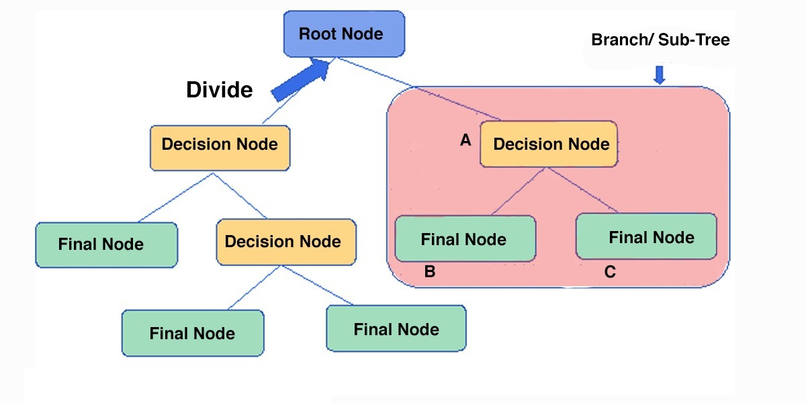

# Machine Learning
## Type Learning

1. Rodri
- Aprendizaje semisupervisado
- Aprendizaje no supervisado
  
2. Antonio
- Aprendizaje supervisado
- Aprendizaje reforzaado
  
## Model types

---
#### Aprendizaje Supervisado
- **Regression**:
In Machine Learning, we use various kinds of algorithms to allow machines to learn the relationships within the data provided and make predictions based on patterns or rules identified from the dataset. So, regression is a machine learning technique where the model predicts the output as a continuous numerical value

- **[Naive Bayesian Algorithm](https://www.javatpoint.com/machine-learning-naive-bayes-classifier#:~:text=Na%C3%AFve%20Bayes%20Classifier%20is%20one,the%20probability%20of%20an%20object.)**:
Applying Bayes' theorem, these algorithms classify values ​​as independent of any other data in the set under study, allowing a class or category to be predicted based on a predetermined set of characteristics using a probabilistic index.
This type of algorithm is one of the most implemented since, despite its simplicity, it allows highly complex data classifications.

[example mailing SPAM](https://medium.com/analytics-vidhya/email-spam-classifier-using-naive-bayes-a51b8c6290d4)

---
#### Aprendizaje No Supervisado
- **Clustering**:
They are mainly used in unsupervised machine learning since it allows organizing and categorizing unlabeled data. This algorithm performs group searches within the data represented by a variable. It works iteratively to assign each data point to one of the groups represented in the variable based on the characteristics that were set as default.

- **Decision Tree**:
A decision tree is a very useful structural tool for choosing options based on pre-established managerial criteria. Similar to a flowchart, it uses a branching method to represent the possible outcomes of executing a decision. Within the tree, nodes are generated that represent specific variables and the results of the executed tests can be observed in the branches.

- **Artificial Neuronal Networks**:
An artificial neural network comprises a set of units that are in a series of layers that are in turn connected to adjoining layers, resembling the type of connections that are generated in biological systems such as neurons in the brain. These networks are interconnected sets of data that work together to solve specific problems.

- **Análisis de Componentes Principales**:
PCA es un procedimiento estadístico que usa una transformación ortogonal para convertir un conjunto de observaciones de variables posiblemente correlacionadas en un conjunto de valores de variables linealmente no correlacionadas llamadas componentes principales. Análisis de componentes principales. 
Algunas de las aplicaciones de PCA incluyen compresión, simplificación de datos para un aprendizaje más fácil, visualización. Tenga en cuenta que el conocimiento del dominio es muy importante al elegir si seguir adelante con PCA o no. No es adecuado en los casos en que los datos son ruidosos (todos los componentes de PCA tienen una variación bastante alta).

